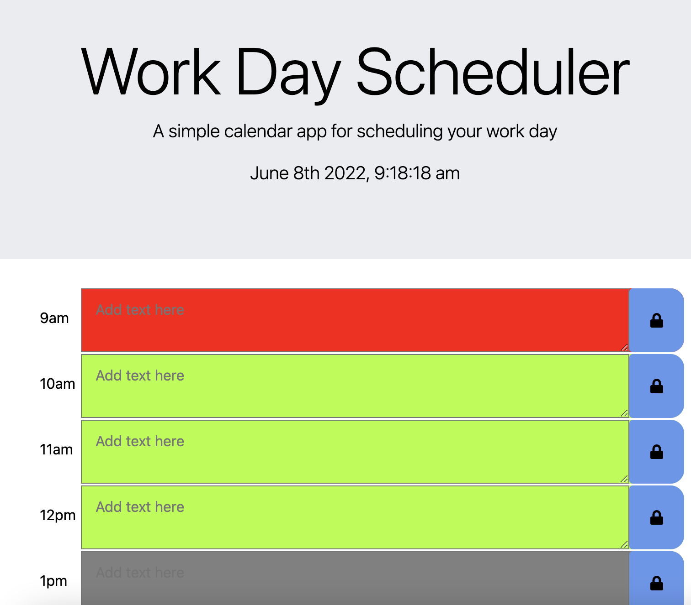

# Work Day Scheduler

live site at : https://marlowecrosland.github.io/work-day-scheduler/

This is a daily planner/scheduler with which you can plan you work day

the background of the time blocks change color red, grey, or green depending on if an activity is in the past, present or future

the time is displayed at the top always to help the user stay punctual.

the blue lock button saves the users scheduled items to localStorage
